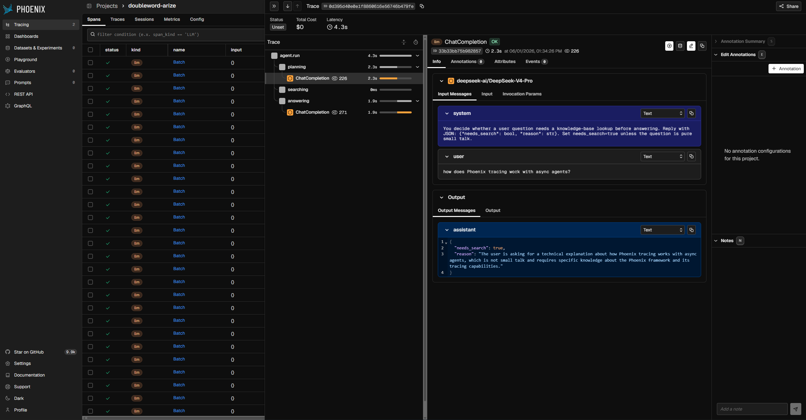

<p align="center">
  <a href="https://www.doubleword.ai"></a>
</p>

# Async Agent Observability with Doubleword + Arize Phoenix

This project shows a working async search-and-answer agent traced end-to-end with [Arize Phoenix](https://arize.com/phoenix), scored by [LLM-as-a-judge](https://doubleword.ai/glossary#llm-as-a-judge) evals at up to **90% off realtime** via [Doubleword](https://www.doubleword.ai) and [autobatcher](https://pypi.org/project/autobatcher/).

"C:\Users\jaedo\GitHub\doubleword-arize\images\demo-hero.png"
<p align="center">
  
</p>

### Why this matters

A single agent request can run a planning step, a retrieval, a tool call, and a final answer — each with its own latency, model, and failure mode. Input/output logging doesn't capture this; span-level tracing does. You see exactly which step caused a regression and can run evals against any span, not just the final output.

The other half is cost. Agentic workloads make many calls per request, so running evals at realtime prices doesn't scale. Doubleword's async tier is ~50% cheaper; batch is ~90% cheaper. One key. One SDK shape.

| Tier | Cost vs realtime | SLA | Client |
|---|---|---|---|
| Realtime | Full price | Immediate | `openai.AsyncOpenAI` |
| Async | ~50% off | ~1 hour | `autobatcher.AsyncOpenAI` |
| Batch | ~90% off | Up to 24 hours | `autobatcher.BatchOpenAI` |

Pricing on DeepSeek V4 Pro (May 2026): **$1.74 / $3.48** per million tokens realtime → **$0.87 / $1.74** batch. This project defaults to DeepSeek V4 Pro as **both** the chat model and the LLM-as-judge — running a top-tier model as judge is a great way to save while maintaining high quality outputs in production. See [doubleword.ai/pricing](https://doubleword.ai/pricing/).

---

## Tutorial

### 1. Get a Doubleword API key

1. Sign in at [app.doubleword.ai](https://app.doubleword.ai/).
2. Open the **API Keys** page in the dashboard.
3. Create a key and copy it. The same key covers realtime, async, and batch.

### 2. Configure

This project uses the [uv](https://docs.astral.sh/uv/) package manager. Copy the example env file and paste your key:

```bash
# macOS / Linux
cp .env.example .env

# Windows PowerShell
Copy-Item .env.example .env
```

Open `.env` and replace the `DOUBLEWORD_API_KEY=dw-...` placeholder with your key. Every other setting (model names, project name, Phoenix endpoint, concurrency, batch SLA) has a working default in [`src/dwp/config.py`](src/dwp/config.py) — only override what you need in `.env`; `.env` wins.

### 3. Start Phoenix

```bash
docker compose -f docker-compose.yaml up -d
# Phoenix UI at http://localhost:6006
#
# Phoenix-only (no Postgres), for an existing stack:
# docker compose -f compose.phoenix-only.yaml up -d
```

Requires [Docker](https://www.docker.com/get-started/). The UI opens on the empty `default` project — that's expected. The agent writes to its own project (`doubleword-arize`), auto-created on the first run below. 

### 4. Install

```bash
uv sync --extra dev
```

### 5. Run the agent (realtime)

```bash
uv run python examples/run_agent.py "what is OpenInference?"
```

**What you should see:** the script prints an answer, then `Trace sent to Phoenix`. Open [http://localhost:6006/projects](http://localhost:6006/projects), click into **doubleword-arize**, and you'll see one trace:

```
agent.run
├─ planning      (LLM: ChatCompletion)
├─ searching     (optional, only if planner decides)
└─ answering     (LLM: ChatCompletion)
```

### 6. Fan out concurrent traces

```bash
uv run python examples/run_concurrent.py
```

Five queries run in parallel via `asyncio.gather`. In the Phoenix timeline you'll see five overlapping root traces — the async-first design in practice.

### 7. Try the cheaper tiers

`MODE` controls which Doubleword tier `examples/run_agent.py` and `examples/run_concurrent.py` use:

```bash
MODE=async uv run python examples/run_concurrent.py   # ~50% off
MODE=batch uv run python examples/run_concurrent.py   # ~90% off
```

The agent code is identical across all three modes; only [`src/dwp/clients.py`](src/dwp/clients.py) `build_chat_client(mode=...)` changes which OpenAI-shaped client is returned.

### 8. Score outputs with LLM-as-judge evals

After steps 5–7 have produced traces:

```bash
uv run python examples/run_async_evals.py     # ~50% off, ~1h
uv run python examples/run_batch_evals.py     # ~90% off, up to 24h
```

These read `answering` spans from Phoenix, score them with the judge in [`src/dwp/evals/judges.py`](src/dwp/evals/judges.py), and write the results back as `quality` / `quality_batch` annotations on the original spans. Filter by `eval.quality.label == 'low_relevance'` in Phoenix to find outputs worth reviewing.

---

## Use it in your own app

Two additions, no architecture changes — see [docs/guides/existing-app.md](docs/guides/existing-app.md). The short version:

```python
# 1. Bootstrap Phoenix tracing once at startup
from phoenix.otel import register
register(project_name="my-app", auto_instrument=True, batch=True)

# 2. Point the OpenAI SDK at Doubleword (drop-in)
from openai import AsyncOpenAI
client = AsyncOpenAI(api_key="<DOUBLEWORD_API_KEY>", base_url="https://api.doubleword.ai/v1")
```

For the cheaper tiers, swap the import — same call shape, ~50% / ~90% off:

```python
from autobatcher import AsyncOpenAI   # ~50% off, ~1h
from autobatcher import BatchOpenAI   # ~90% off, up to 24h
```

The autobatcher clients are async context managers — use `async with` so queued requests flush on exit. See [docs/guides/async-evals.md](docs/guides/async-evals.md) for the eval-loop pattern.

---

## Guides

- [Build a new async agent](docs/guides/new-async-agent.md) — span-first design from scratch
- [Add observability to an existing app](docs/guides/existing-app.md) — two additions, no architecture changes
- [Async and batch evals](docs/guides/async-evals.md) — LLM-as-judge off the hot path

---

## Tests

```bash
uv run pytest                             # 41 mocked tests, no network
RUN_INTEGRATION=1 uv run pytest -m integration   # 3 real-API tests (one per mode)
```

The default suite has no external dependencies. The opt-in integration suite hits the real Doubleword API once per mode (realtime / async / batch) and asserts a non-empty completion.

---

## Troubleshooting

- **Phoenix won't start.** Check `docker ps` — port `6006` (UI) and `4317` (OTLP) need to be free. `docker compose logs phoenix` shows startup errors.
- **No spans in the UI.** Phoenix's landing page shows the empty `default` project. Navigate to **Projects → doubleword-arize**.
- **`run_async_evals.py` says "No answering spans found".** Run step 5 or 6 first to produce `answering` spans, then re-run.
- **Integration tests skipped.** They only run with `RUN_INTEGRATION=1` *and* a real `DOUBLEWORD_API_KEY` in `.env`.

---

## Project layout

```
src/dwp/
  config.py          env → validated settings; defaults live here
  tracing.py         one-line Phoenix bootstrap
  clients.py         Doubleword client factory: realtime / async / batch
  agent.py           span-first async agent (planning / searching / answering)
  corpus.py          in-memory retrieval (swap for your own)
  evals/
    judges.py        Score model + shared judge prompt
    online.py        ~50% off eval loop (autobatcher.AsyncOpenAI)
    batch.py         ~90% off eval loop (autobatcher.BatchOpenAI)
examples/            one entry-point per scenario
tests/               mocked suite (default) + tests/integration/ (opt-in)
docs/guides/         how-to guides for each part of the stack
```
